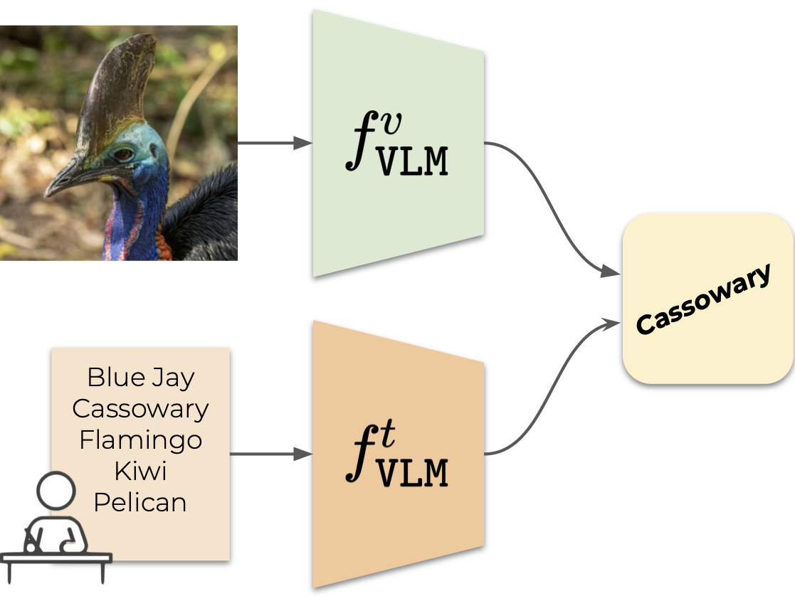

<div align="center">

<a href="https://www.python.org"></a>
<a href="https://pytorch.org/get-started/locally/"></a>
<a href="https://pytorchlightning.ai/"></a>

[](https://github.com/altndrr/vic)
[](https://altndrr-vic.hf.space)
[](https://arxiv.org/abs/2306.00917)
[](https://altndrr.github.io/vic/)

# Vocabulary-free Image Classification

[Alessandro Conti](https://scholar.google.com/citations?user=EPImyCcAAAAJ), [Enrico Fini](https://scholar.google.com/citations?user=OQMtSKIAAAAJ), [Massimiliano Mancini](https://scholar.google.com/citations?user=bqTPA8kAAAAJ), [Paolo Rota](https://scholar.google.com/citations?user=K1goGQ4AAAAJ), [Yiming Wang](https://scholar.google.com/citations?user=KBZ3zrEAAAAJ), [Elisa Ricci](https://scholar.google.com/citations?user=xf1T870AAAAJ)

</div>

Recent advances in large vision-language models have revolutionized the image classification paradigm. Despite showing impressive zero-shot capabilities, a pre-defined set of categories, a.k.a. the vocabulary, is assumed at test time for composing the textual prompts. However, such assumption can be impractical when the semantic context is unknown and evolving. We thus formalize a novel task, termed as Vocabulary-free Image Classification (VIC), where we aim to assign to an input image a class that resides in an unconstrained language-induced semantic space, without the prerequisite of a known vocabulary. VIC is a challenging task as the semantic space is extremely large, containing millions of concepts, with hard-to-discriminate fine-grained categories.

<div align="center">

|   |  |
| :----------------------------------------------: | :----------------------------------------------: |
| Vision Language Model (VLM)-based classification |       Vocabulary-free Image Classification       |

</div>

In this work, we first empirically verify that representing this semantic space by means of an external vision-language database is the most effective way to obtain semantically relevant content for classifying the image. We then propose Category Search from External Databases (CaSED), a method that exploits a pre-trained vision-language model and an external vision-language database to address VIC in a training-free manner. CaSED first extracts a set of candidate categories from captions retrieved from the database based on their semantic similarity to the image, and then assigns to the image the best matching candidate category according to the same vision-language model. Experiments on benchmark datasets validate that CaSED outperforms other complex vision-language frameworks, while being efficient with much fewer parameters, paving the way for future research in this direction.

<div align="center">

|                                                                                                                                                                                                                                                    |
| :--------------------------------------------------------------------------------------------------------------------------------------------------------------------------------------------------------------------------------------------------------------------------------------------: |
| Overview of CaSED. Given an input image, CaSED retrieves the most relevant captions from an external database filtering them to extract candidate categories. We classify image-to-text and text-to-text, using the retrieved captions centroid as the textual counterpart of the input image. |

</div>

## Setup

### Install dependencies

```bash
# clone project
git clone https://github.com/altndrr/vic
cd vic

# install requirements
# it will create a .venv folder in the project root
# and install all the dependencies using flit
make install

# activate virtual environment
source .venv/bin/activate
```

### Setup environment variables

```bash
# copy .env.example to .env
cp .env.example .env

# edit .env file
vim .env
```

## Usage

The two entry points are `train.py` and `eval.py`. Calling them without any argument will use the default configuration.

```bash
# train model
python src/train.py

# test model
python src/eval.py
```

### Configuration

The full list of parameters can be found under [configs](configs/), but the most important ones are:

- [data](configs/data/): dataset to use, default to `caltech101`.
- [experiment](configs/experiment/): experiment to run, default to `baseline/clip`.
- [logger](configs/logger/): logger to use, default to `null`.

Parameters can be overwritten by passing them as command line arguments. You can additionally override any parameter from the config file by using the `++` prefix.

```bash
# train model on ucf101 dataset
python src/train.py data=ucf101 experiment=baseline/clip

# train model on ucf101 dataset with RN50 backbone
python src/train.py data=ucf101 experiment=baseline/clip model=clip ++model.model_name=RN50
```

Note that since all our approaches are training-free, there is virtually no difference between `train.py` and `eval.py`. However, we still keep them separate for clarity.

### Docker containers

We provide Docker images for the deployment of containerized services. Currently, the only available container is the one for the retrieval server. To start the server, run the following command:

```bash
# build the Docker images
docker compose build

# start the server
docker compose --profile retrieval-server up
```

## Development

### Install pre-commit hooks

```bash
# install pre-commit hooks
pre-commit install
```

### Run tests

```bash
# run fast tests
make test

# run all tests
make test-full
```

### Format code

```bash
# run linters
make format
```

### Clean repository

```bash
# remove autogenerated files
make clean

# remove logs
make clean-logs
```
